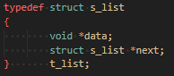

<!DOCTYPE html>
<html>
<body>
  <h1>Libasm Project :</a></h1>
  Welcome to the libasm project ! 
  This project aims to provide an introduction to <a href="https://fr.wikipedia.org/wiki/Assembly_language">Assembly language</a> and a deeper understanding of <a href="https://en.wikipedia.org/wiki/Processor_register">Processor register</a>.
  
  <h2>Project Description</h2>
  
The focus of this project will be to rewrite basic libc functions in assembly

    <h3>Mandatory Part:</h3>
    <ul>
        <li>ft_strlen</li>
        <li>ft_strlcpy</li>
        <li>ft_strcmp</li>
        <li>ft_write</li>
        <li>ft_read</li>
        <li>ft_strdup</li>
    </ul>
    <h3>Bonus Part:</h3>
    <ul>
        <li>ft_atoi_base</li>
        <li>ft_list_push_front</li>
        <li>ft_list_size</li>
        <li>ft_list_sort</li>
        <li>ft_list_remove_if</li>
    
    </ul>
  <h2>Project Requirements</h2>
  <ul>
    <li>Must write 64 bits ASM. Beware of the <a href="https://learn.microsoft.com/en-us/cpp/build/x64-calling-convention?view=msvc-170">calling convention</a>.</li>
    <li>Can’t do inline ASM, you must do ’.s’ files</li>
    <li>Must compile your assembly code with <a href="https://fr.wikipedia.org/wiki/Netwide_Assembler">nasm</a>.</li>
    <li>You must use the <a href="https://imada.sdu.dk/u/kslarsen/dm546/Material/IntelnATT.htm">Intel syntax</a>, not the AT&T</li>
  </ul>

  <h2>Resources</h2>
  <ul>
    <li><a href="https://www.ibm.com/docs/en/aix/7.2?topic=aix-assembler-language-reference">Assembler's Documentation</a></li>
    <li><a href="https://www.tutorialspoint.com/assembly_programming/">Learn NASM programming</a></li>
    <li><a href="https://www.youtube.com/playlist?list=PL2EF13wm-hWCoj6tUBGUmrkJmH1972dBB">Learning x86 with NASM playlist</a></li>
    <li><a href="https://blog.rchapman.org/posts/Linux_System_Call_Table_for_x86_64/">Linux System Call Table</a></li>
</body>
</html>
